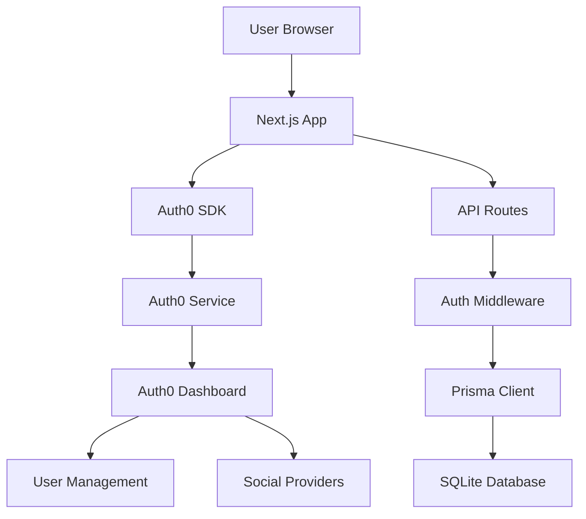
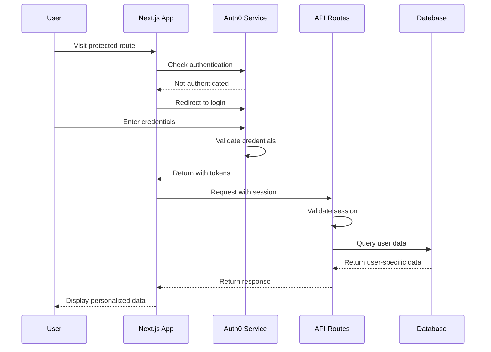

# Design Document - Auth0 Real Authentication

## Overview

This design implements a complete Auth0 authentication system that replaces the current demo authentication. The system will provide secure user authentication, data isolation, and proper session management while maintaining the existing user experience.

## Architecture

### High-Level Architecture



### Authentication Flow



## Components and Interfaces

### 1. Auth0 Configuration

**File:** `src/lib/auth0-config.ts`

```typescript
interface Auth0Config {
  domain: string;
  clientId: string;
  clientSecret: string;
  baseUrl: string;
  secret: string;
  scope: string;
  routes: {
    login: string;
    logout: string;
    callback: string;
    postLogoutRedirect: string;
  };
}
```

### 2. User Session Interface

**File:** `src/types/auth.ts`

```typescript
interface UserSession {
  user: {
    sub: string; // Auth0 user ID
    email: string;
    name?: string;
    picture?: string;
    email_verified: boolean;
  };
  accessToken?: string;
  idToken?: string;
  refreshToken?: string;
}
```

### 3. Authentication Middleware

**File:** `src/lib/auth-middleware.ts`

```typescript
interface AuthMiddleware {
  requireAuth(handler: NextApiHandler): NextApiHandler;
  getCurrentUser(req: NextRequest): Promise<UserSession | null>;
  createUserIfNotExists(session: UserSession): Promise<User>;
}
```

### 4. Protected API Route Pattern

```typescript
// Standard pattern for all API routes
export async function GET(request: NextRequest) {
  try {
    // 1. Get authenticated user
    const session = await getSession(request);
    if (!session) {
      return NextResponse.json({ error: 'Unauthorized' }, { status: 401 });
    }

    // 2. Get or create user in database
    const user = await findOrCreateUser(session.user);

    // 3. Query data scoped to user
    const data = await prisma.someModel.findMany({
      where: { userId: user.id },
    });

    return NextResponse.json({ success: true, data });
  } catch (error) {
    return handleApiError(error);
  }
}
```

## Data Models

### Updated User Model

The existing Prisma User model already supports Auth0 integration:

```prisma
model User {
  id            String    @id @default(cuid())
  name          String?
  email         String    @unique
  emailVerified DateTime?
  image         String?
  createdAt     DateTime  @default(now())
  updatedAt     DateTime  @updatedAt

  // Relations - all scoped to user
  moodEntries       MoodEntry[]
  insights          Insight[]
  journalEntries    JournalEntry[]
  breathingSessions BreathingSession[]
  goals             Goal[]
}
```

### Auth0 User Mapping

```typescript
// Map Auth0 user to database user
function mapAuth0User(auth0User: any): Partial<User> {
  return {
    email: auth0User.email,
    name: auth0User.name || auth0User.nickname,
    image: auth0User.picture,
    emailVerified: auth0User.email_verified ? new Date() : null,
  };
}
```

## Error Handling

### Authentication Errors

```typescript
enum AuthError {
  UNAUTHORIZED = 'UNAUTHORIZED',
  SESSION_EXPIRED = 'SESSION_EXPIRED',
  INVALID_TOKEN = 'INVALID_TOKEN',
  USER_NOT_FOUND = 'USER_NOT_FOUND',
  AUTH0_ERROR = 'AUTH0_ERROR',
}

interface AuthErrorResponse {
  error: AuthError;
  message: string;
  redirectTo?: string;
}
```

### Error Handling Strategy

1. **Client-side errors**: Redirect to login page
2. **API errors**: Return appropriate HTTP status codes
3. **Auth0 errors**: Log and show user-friendly messages
4. **Network errors**: Provide retry mechanisms

## Testing Strategy

### Unit Tests

1. **Authentication middleware tests**
   - Valid session handling
   - Invalid session handling
   - User creation logic

2. **API route tests**
   - Authenticated requests
   - Unauthenticated requests
   - Data isolation verification

3. **User management tests**
   - User creation from Auth0 data
   - Profile updates
   - Data scoping

### Integration Tests

1. **Auth0 flow testing**
   - Login/logout flows
   - Token refresh
   - Session management

2. **Data isolation tests**
   - Multiple users with separate data
   - Cross-user access prevention
   - API security verification

### Manual Testing Checklist

- [ ] User can sign up with email/password
- [ ] User can sign up with Google
- [ ] User can log in and out
- [ ] User sees only their own data
- [ ] API routes are properly secured
- [ ] Session expiration works correctly
- [ ] Error messages are user-friendly

## Security Considerations

### 1. Token Security

- Use secure HTTP-only cookies for session storage
- Implement proper token refresh logic
- Set appropriate token expiration times

### 2. Data Isolation

- All database queries MUST include user ID filtering
- Implement row-level security where possible
- Validate user ownership before any data operations

### 3. API Security

- Validate authentication on every API call
- Implement rate limiting
- Use HTTPS in production
- Sanitize all user inputs

### 4. Session Management

- Implement proper session cleanup
- Handle concurrent sessions appropriately
- Provide session monitoring capabilities

## Implementation Phases

### Phase 1: Auth0 Setup (15 minutes)

1. Create Auth0 account and application
2. Configure callback URLs and settings
3. Update environment variables
4. Test basic authentication flow

### Phase 2: Authentication Integration (15 minutes)

1. Update API routes with real authentication
2. Implement user session handling
3. Add authentication middleware
4. Test API security

### Phase 3: Data Isolation (10 minutes)

1. Update all database queries to include user filtering
2. Implement user creation logic
3. Test data separation between users
4. Verify no data leakage

### Phase 4: Testing and Polish (5 minutes)

1. Test complete authentication flow
2. Verify all features work with real auth
3. Test error scenarios
4. Final security verification

## Rollback Plan

If issues occur during implementation:

1. **Immediate rollback**: Revert environment variables to demo values
2. **API rollback**: Restore demo user logic in API routes
3. **Database rollback**: No database changes needed
4. **Frontend rollback**: Auth0 components will fall back to demo mode

## Success Metrics

- [ ] Users can successfully authenticate with Auth0
- [ ] Each user sees only their own data
- [ ] All API endpoints require authentication
- [ ] No cross-user data access possible
- [ ] Authentication errors are handled gracefully
- [ ] Performance impact is minimal
- [ ] User experience remains smooth
