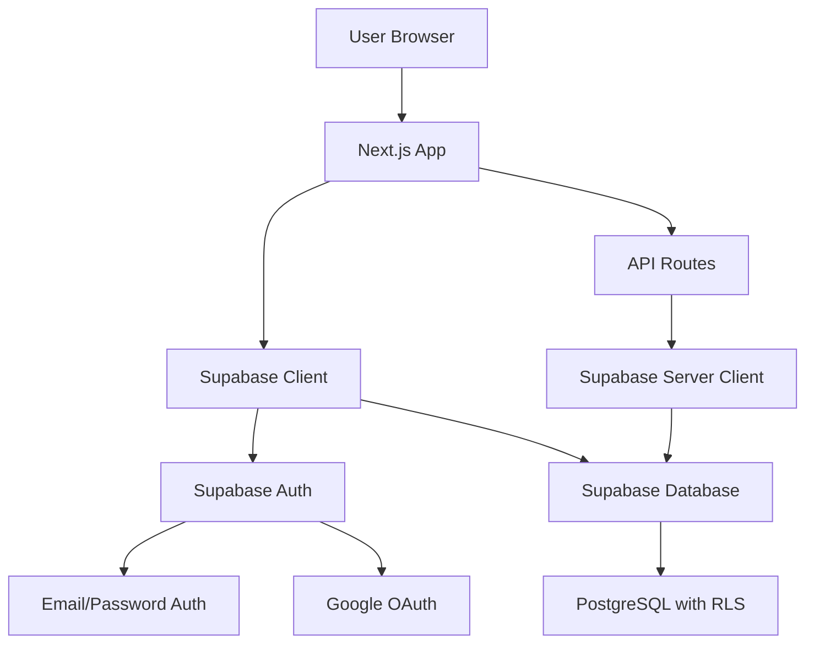
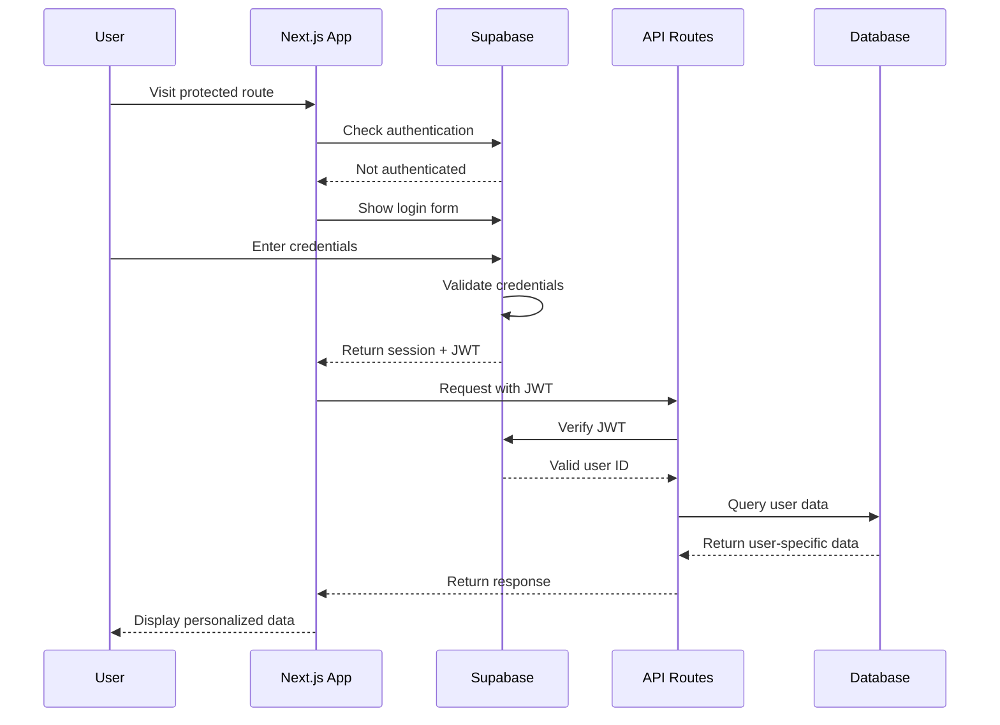

# Design Document - Supabase Authentication

## Overview

This design implements Supabase authentication to provide secure, user-isolated access to mental health data. Supabase offers a complete backend-as-a-service with authentication, database, and real-time features.

## Architecture

### High-Level Architecture



### Authentication Flow



## Components and Interfaces

### 1. Supabase Configuration

**File:** `src/lib/supabase.ts`
```typescript
import { createClient } from '@supabase/supabase-js'

const supabaseUrl = process.env.NEXT_PUBLIC_SUPABASE_URL!
const supabaseAnonKey = process.env.NEXT_PUBLIC_SUPABASE_ANON_KEY!

export const supabase = createClient(supabaseUrl, supabaseAnonKey)

// Server-side client for API routes
export const supabaseServer = createClient(
  supabaseUrl,
  process.env.SUPABASE_SERVICE_ROLE_KEY!
)
```

### 2. Authentication Hook

**File:** `src/hooks/useAuth.ts`
```typescript
interface AuthUser {
  id: string;
  email: string;
  name?: string;
  avatar?: string;
}

interface UseAuth {
  user: AuthUser | null;
  loading: boolean;
  signIn: (email: string, password: string) => Promise<void>;
  signUp: (email: string, password: string) => Promise<void>;
  signOut: () => Promise<void>;
  signInWithGoogle: () => Promise<void>;
}
```

### 3. Protected API Route Pattern

```typescript
// Standard pattern for all API routes
export async function GET(request: NextRequest) {
  try {
    // 1. Get JWT from request
    const token = request.headers.get('authorization')?.replace('Bearer ', '');
    
    // 2. Verify with Supabase
    const { data: { user }, error } = await supabaseServer.auth.getUser(token);
    if (error || !user) {
      return NextResponse.json({ error: 'Unauthorized' }, { status: 401 });
    }

    // 3. Query data scoped to user
    const data = await prisma.someModel.findMany({
      where: { userId: user.id }
    });

    return NextResponse.json({ success: true, data });
  } catch (error) {
    return handleApiError(error);
  }
}
```

## Data Models

### User Integration

```typescript
// Map Supabase user to local database
async function syncSupabaseUser(supabaseUser: any) {
  return await prisma.user.upsert({
    where: { id: supabaseUser.id },
    update: {
      email: supabaseUser.email,
      name: supabaseUser.user_metadata?.name,
      image: supabaseUser.user_metadata?.avatar_url,
      updatedAt: new Date()
    },
    create: {
      id: supabaseUser.id, // Use Supabase UUID
      email: supabaseUser.email,
      name: supabaseUser.user_metadata?.name,
      image: supabaseUser.user_metadata?.avatar_url
    }
  });
}
```

## Implementation Phases

### Phase 1: Supabase Setup (5 minutes)
1. Create Supabase project
2. Configure authentication providers
3. Get API keys and URL
4. Update environment variables

### Phase 2: Install and Configure (5 minutes)
1. Install Supabase client library
2. Create Supabase client configuration
3. Set up authentication context
4. Create auth hooks

### Phase 3: Update API Routes (5 minutes)
1. Add Supabase authentication to all API routes
2. Update database queries with user filtering
3. Test API security
4. Verify data isolation

### Phase 4: Frontend Integration (5 minutes)
1. Add login/signup forms
2. Implement authentication state management
3. Add protected route guards
4. Test complete flow

## Security Features

### Automatic Security
- **JWT tokens** handled automatically by Supabase
- **Row Level Security** can be enabled in Supabase
- **HTTPS** enforced by Supabase
- **Rate limiting** built into Supabase

### Data Isolation
- All queries filtered by `user.id` from Supabase JWT
- No cross-user data access possible
- Automatic session management

## Error Handling

```typescript
enum SupabaseAuthError {
  INVALID_CREDENTIALS = 'Invalid login credentials',
  EMAIL_NOT_CONFIRMED = 'Email not confirmed',
  WEAK_PASSWORD = 'Password should be at least 6 characters',
  USER_NOT_FOUND = 'User not found',
  SESSION_EXPIRED = 'Session expired'
}
```

## Testing Strategy

### Manual Testing
- [ ] User can sign up with email/password
- [ ] User can log in and out
- [ ] User sees only their own data
- [ ] API routes require authentication
- [ ] Session expiration works
- [ ] Error messages are clear

## Success Metrics

- [ ] Simple 15-minute setup
- [ ] Users authenticate successfully
- [ ] Complete data isolation
- [ ] All API endpoints secured
- [ ] Good user experience
- [ ] Easy maintenance